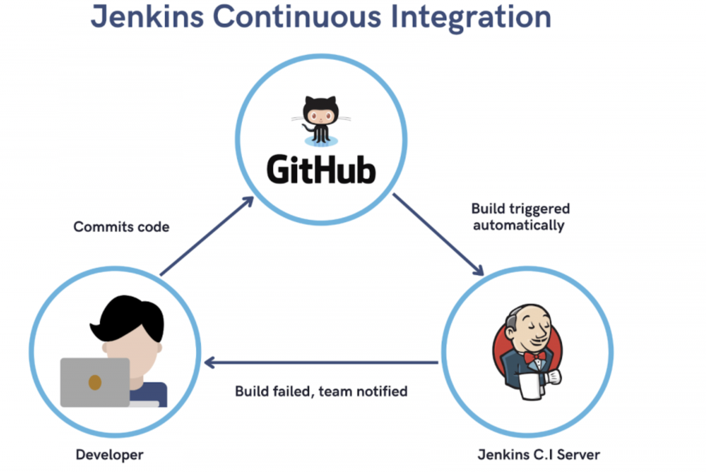
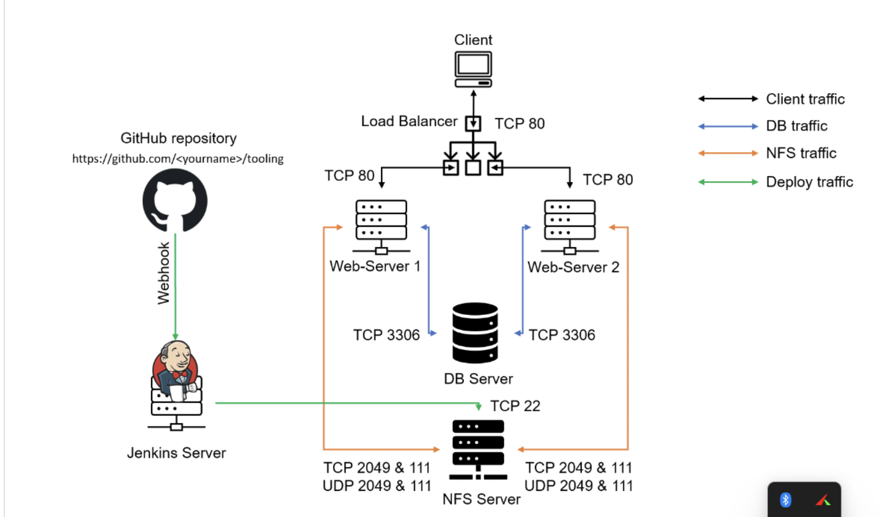

## Introduction

This project builds upon two previous projects:
1. [DevOps Tooling Website Solution](https://github.com/kenneth-stack/DevOps-Tooling-website-solution.git)
2. [Load Balancer Solution with Apache](https://github.com/kenneth-stack/Load-Balancer-With-Apache.git)

We're extending these solutions by introducing Continuous Integration/Continuous Deployment (CI/CD) using Jenkins. The goal is to create a more automated deployment process for our DevOps tooling website.

## What Is Jenkins
Jenkins is an open-source Continuous Integration server written in Java for orchestrating a chain of actions to achieve the Continuous Integration process in an automated fashion. Jenkins supports the complete development life cycle of software from building, testing, documenting the software, deploying, and other stages of the software development life cycle.



## Jenkins Web Architecture For CI Builds



### Project Purpose

The implementation of CI/CD in this project ensures continuous delivery of changes to the DevOps tooling website with minimal manual intervention. This setup automates build, test, and deployment processes, which reduces errors, improves development speed, and ensures that each release is reliable and deployable.

## Project Overview

We're enhancing our existing infrastructure by:

1. Utilizing the web, database, and NFS server setup from the [DevOps Tooling Website Solution](https://github.com/kenneth-stack/DevOps-Tooling-website-solution.git) project.
2. Leveraging the load balancer implemented in the [Load Balancer Solution with Apache](https://github.com/kenneth-stack/Load-Balancer-With-Apache.git) project.
3. Setting up a Jenkins server for automated building and deployment of our application.
4. Integrating our GitHub repository with Jenkins for continuous integration.

This setup will streamline our development and deployment processes, providing a robust infrastructure for our DevOps tooling website.

## Implementation Steps

### Step 1: Set Up Jenkins Server

1. Provision an EC2 instance for Jenkins (t2.micro, Ubuntu 24.04 LTS).
2. Configure security groups to allow necessary traffic (SSH on port 22, HTTP on port 8080).

### Step 2: Configure Jenkins for CI/CD

1. Update the system and install the default JDK:

```bash
   sudo apt update
   sudo apt install default-jdk-headless
```
.png)

2. Install Jenkins using the official Jenkins repository:

```bash
   sudo wget -O /usr/share/keyrings/jenkins-keyring.asc \
     https://pkg.jenkins.io/debian/jenkins.io-2023.key
   echo "deb [signed-by=/usr/share/keyrings/jenkins-keyring.asc]" \
     https://pkg.jenkins.io/debian binary/ | sudo tee \
     /etc/apt/sources.list.d/jenkins.list > /dev/null
   ```

   ```bash
   sudo apt-get update
   sudo apt-get install jenkins
   ```
   .png)

3. Start Jenkins and enable it to run on boot:

```bash
   sudo systemctl start jenkins
   sudo systemctl enable jenkins
```

4. Check the status of Jenkins to ensure it's running:

```bash
   sudo systemctl status jenkins
```
.png)

5. Access Jenkins through your browser by navigating to `http://<your-server-ip>:8080` and complete the initial setup.

6. During the initial setup, you'll be asked for the initial admin password. You can retrieve it with:

```bash
   sudo cat /var/lib/jenkins/secrets/initialAdminPassword
   ```

7. Follow the on-screen instructions to complete the installation, including installing recommended plugins and creating the first admin user.

.png)
.png)
.png)
.png)
.png)

### Step 3: Integrate GitHub with Jenkins with Webhook

1. Add a Webhook in GitHub

   - Open the GitHub repository for your project: [https://github.com/kenneth-stack/tooling.git](https://github.com/kenneth-stack/tooling.git).
   - Go to **Settings** > **Webhooks**.
   - Click **Add webhook** and configure it as follows:
     - **Payload URL**: Enter your Jenkins webhook URL:
       
```bash
       http://54.236.47.225:8080//github-webhook/
```

     - **Content type**: Select `application/json`.
     - **Which events would you like to trigger this webhook?**: Choose **Just the push event**.
   - Click **Add webhook** to save.

This webhook will notify Jenkins of any push events in the GitHub repository, triggering an automated build.

.png)

2. Create a New Jenkins Job

   - Go to your Jenkins Dashboard at `http://54.236.47.225:8080/`.
   - Click **New Item**.
   - Name the job `tooling_github`, select **Freestyle project**, and click **OK**.

3. Configure Source Code Management

   - In the job configuration page, scroll to the **Source Code Management** section.
   - Select **Git** and enter the GitHub repository URL:

```bash
     https://github.com/kenneth-stack/tooling.git
```

   - In the **Credentials** dropdown, add your GitHub credentials (username and password or a personal access token)
   .png)

   - save and then test the configuration by clicking **build now** in job page
   .png)

4. Configure Build Trigger

   - In the job page, click on **configure** 
   - Scroll down to the **Build Triggers** section.
   - Select **GitHub hook trigger for GITScm polling**. This will ensure Jenkins triggers a build every time a change is pushed to GitHub.
   .png)

   - Scroll to the **Post-build Actions** section.
   - Click **Add post-build action** and select **Archive the artifacts**.
   - In the **Files to archive** field, enter `**`, which will archive all files generated during the build.
   .png)

   - Click **Save** to finalize the configuration.
   - To test the setup, push a change to the GitHub repository, which should trigger an automatic build in Jenkins.
   - Check the **Build History** in Jenkins to confirm that the build triggered correctly. You should also see the archived files in the build’s **Artifacts** section.
   .png)
   .png)

### Step 4: Configure Jenkins to copy build files to NFS server vis SSH

1. Install the "Publish over SSH" Plugin

   - From the Jenkins Dashboard, go to **Manage Jenkins**.
   - Select **Manage Plugins**.
   - Go to the **Available plugins** tab.
   - Search for **Publish over SSH** and install it by clicking **Install without restart**.
   - Once installed, restart Jenkins to apply the plugin.
.png)
.png)

2. Configure SSH Connection to the NFS Server

   - From the Jenkins Dashboard, go to **Manage Jenkins** > **Configure System**.
   - Scroll down to the **Publish over SSH** section.
   - Click **Add** under the SSH Servers to add the NFS server configuration.

   Enter the following details about the NFS server:

   - **Name**: Enter an identifiable name (e.g., "NFS server").
   - **Hostname**: Enter the private IP of the NFS server: `172.31.10.195`.
   - **Username**: Enter the SSH username for the NFS server (typically `ec2-user`).
   - **Remote Directory**: Enter the target directory on the NFS server where files will be copied (e.g., `/mnt/apps`).
   - **SSH Key**: Paste the content of the Jenkins server’s private SSH key.

   > **Note**: Ensure the NFS server's `~/.ssh/authorized_keys` file includes the public key matching this SSH private key.

.png)

3. Update NFS Server Security Group for SSH Access

   - In the AWS Management Console, go to **EC2** > **Security Groups**.
   - Locate and edit the security group associated with the NFS server.
   - Add an inbound rule to allow SSH access (port 22) from the Jenkins server’s private IP.
   - Save the changes.
.png)   

4. Test the SSH Configuration

   - Click **Test Configuration** to verify the SSH connection to the NFS server.
   - If successful, Jenkins has established an SSH connection with the NFS server.

5. Save Configuration

   - In Jenkins, scroll down and click **Save**.

6. Test the Configuration with a GitHub Commit

   - Make a change to any file in your GitHub repository (`https://github.com/fmanimashaun/tooling`) and push the update.
   - Check the **Build History** in Jenkins to verify that the webhook triggered a new build.
   - If the build completes successfully, Jenkins should copy the build files to the `/mnt/apps` directory on the NFS server.
.png)   

7. Troubleshoot File Permissions on the NFS Server (if Build Fails)

   - If the build fails to copy files, check the ownership and permissions of the `/mnt/apps` directory on the NFS server.
   - On the NFS server, verify the current permissions. If the ownership is not `nobody:nobody` and permissions are not `777`, run the following commands to correct them:

     ```bash
     sudo chown -R nobody: /mnt/apps
     sudo chmod -R 777 /mnt/apps
     ```

   - After updating permissions, go back to Jenkins, open your project, and click **Build Now** to trigger the build again.
   - If configured correctly, the build should complete, and the files should be accessible on the NFS server.


## Challenges Encountered and Solutions

**1. Setting Up Jenkins on AWS**
Challenge: Configuring Jenkins on an AWS instance involved multiple steps, including handling permissions, dependencies, and security configurations. AWS Security Groups required careful setup to allow traffic on the Jenkins default port (8080).
Solution: Followed a step-by-step approach, starting with updating the system and installing the required Java Development Kit (JDK), which Jenkins depends on. Opened port 8080 on the Security Group to allow external access to the Jenkins console. These actions enabled access and remote interaction with Jenkins.

**2. Configuring GitHub Webhook for Automated Builds**
Challenge: Setting up a webhook between GitHub and Jenkins to automatically trigger builds on code updates required careful configuration. It was crucial to ensure that Jenkins could listen to GitHub events.
Solution: Created a webhook in GitHub and linked it to the Jenkins server by providing the Jenkins URL with /github-webhook/. This connection allowed Jenkins to receive notifications of Git pushes, automatically initiating builds.

**3. Managing Build Artifacts with Jenkins**
Challenge: Ensuring that build artifacts were stored and accessible for deployment was vital, yet configuring Jenkins to archive these artifacts consistently posed some difficulties.
Solution: Set up Jenkins' “Post-build Actions” to archive the build artifacts, ensuring that each build generated an archive of compiled code that could be deployed. This allowed easy access to past build artifacts for troubleshooting and review.

**4. Deploying Artifacts to NFS Server**
Challenge: Transferring build artifacts from Jenkins to an NFS server for deployment required reliable and secure SSH access. The NFS server needed to accept connections and store the artifacts for downstream processes.
Solution: Installed the Publish Over SSH plugin in Jenkins, configured SSH access with a secure private key, and specified the target directory on the NFS server. Testing the SSH connection ensured that Jenkins could securely publish the artifacts to the NFS server.


## Benefits of the Project

**Increased Deployment Speed:** Automation with Jenkins allowed code changes to reach production faster and more reliably, reducing the need for manual intervention.

**Reliability and Consistency:** The CI/CD pipeline ensures consistent builds and deployments, reducing errors and facilitating easy rollbacks using archived artifacts.

**Efficient Collaboration:** Team members can push code changes to GitHub without manually coordinating deployment, as Jenkins handles builds and deployments autonomously.

**Enhanced Security and Control:** Secure configurations with AWS Security Groups, SSH, and GitHub webhooks provide a controlled environment for deployment.

**Scalability:** This setup is scalable across multiple environments, supporting additional servers or services as the project grows.
This automated deployment pipeline provides a structured, secure, and efficient way to manage code from development to deployment, greatly enhancing productivity and stability
